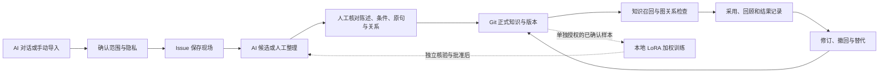
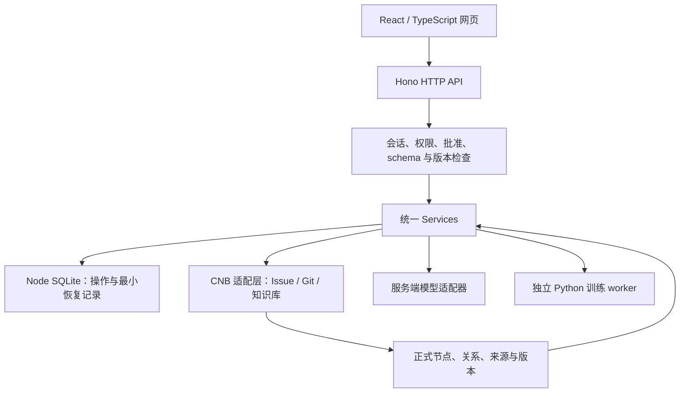

# 掌舵：AI 对话与个人知识图谱

## 作品定位

掌舵面向希望长期积累、查证并复用 AI 对话成果的个人用户。它把对话现场、待审候选、正式知识和实际使用证据分开保存，让 AI 负责提出建议，让人决定什么值得保留、在什么条件下成立，以及何时修订或撤回。

本仓库是比赛的源码与复现交付，不是报名系统提交回执，也不等同于线上生产部署。当前验收范围和未完成项见 [验证记录](验证记录.md)。

## 要解决的问题

- 对话记录按时间堆积，之后难以回到支持某个结论的原句和上下文。
- 摘要与回答容易丢失条件、来源和版本；重复出现的说法不一定更可靠。
- 图谱如果只作展示，不能帮助检索排查前提、冲突、依赖与替代关系。
- 使用 AI 得到答案不等于理解；使用结果应该能反过来触发知识修订。
- 保存、发送模型、入库、训练和删除具有不同后果，需要分别批准。

上述问题是本作品的设计出发点，不作为已完成用户访谈、已取得市场数据或已证实学习效果的声明。

## 核心闭环

模型权重不替代对话原文、Git 知识或图谱关系。未经人工确认的候选不会自动变成正式知识。

## 功能与实现

| 交付能力 | 页面入口 | 主要实现 |
| --- | --- | --- |
| 可信身份与工作区 | `#workspace` | `src/app/connection-panel.tsx`、`src/platform/identity.ts` |
| 完整对话与独立归档 | `#conversation` | `src/app/conversation-panel.tsx`、`src/platform/intelligence.ts` |
| 来源范围、隐私与 AI 候选 | `#capture` | `src/features/capture/` |
| 人工解释、条件、关系与正式入库 | `#handoff` | `src/features/handoff/` |
| 图谱与版本化检索 | `#retrieval` | `src/features/retrieval/` |
| 使用记录、回顾与修订触发 | `#learning` | `src/features/learning/` |
| 版本、撤回、导出和分层删除 | `#governance` | `src/features/governance/` |
| 模型、节点权重与训练记录 | `#intelligence` | `src/app/intelligence-panel.tsx`、`training/worker.py` |

准确 DTO、权限和适配端口以 `src/contracts/` 为准；源码入口存在不意味着所有真实资源已经配置或验收。

## 系统架构

前后端共享 TypeScript/Zod 契约。业务模块通过 Services 协作，不直接导入兄弟模块内部实现。浏览器不持有 CNB 或推理服务令牌；SQLite、训练文件与环境配置不作为网页静态资源提供。

## 设计重点

1. **知识的正式性由人决定。** 候选、人的解释、来源支持、应用证据分别记录，不能用一次模型生成替代确认。
2. **图关系参与检索。** 依赖、冲突、替代和有效版本进入检索判断；关系图同时提供可读路径，不只是一张可视化图片。
3. **结果未知不盲目重发。** 写入绑定原 operationId、请求摘要和版本，丢失响应后只读核验原操作。
4. **应用反馈进入版本循环。** 旧证据保留原引用，修订影响未来检索；不重写历史回答来制造一致。
5. **训练不越过知识治理。** 来源和版本经过核验才成为训练样本；训练、启用、停用和清理分别管理，smoke 永远不作为生产提取器。

这些是本项目的工程选择，不声称学术首创、性能领先或学习效果已经提高。

## 交付范围与边界

| 内容 | 本仓库处理方式 |
| --- | --- |
| 可运行源码与自动化测试 | 纳入版本控制，依赖版本使用锁文件 |
| 无真实账号的合成演示 | 提供专用 fixture 启动入口，合成回复明确标识 |
| 配置与接入说明 | 只提供空值示例，不附带私人令牌 |
| 截图与验证摘要 | 只使用合成数据并标明验证范围 |
| 私人对话、数据库与 live 截图 | 不上传 |
| 模型权重、vendor、虚拟环境与训练产物 | 不上传；训练依赖与命令单独说明 |
| 比赛报名、团队名单、答辩 PPT、视频和 CNB 参赛入口 | 不伪造已提交；由参赛者按实际要求补充和确认 |
| GitHub 仓库 | 源码交付地址，不替代实际 CNB 工作区或比赛要求的 CNB 地址 |

## 评审阅读顺序

先读本说明，再按 [演示与复现](演示与复现.md) 启动合成演示，最后核对 [验证记录](验证记录.md) 和源代码。训练实现与限制见 [训练说明](../training/README.md)。
